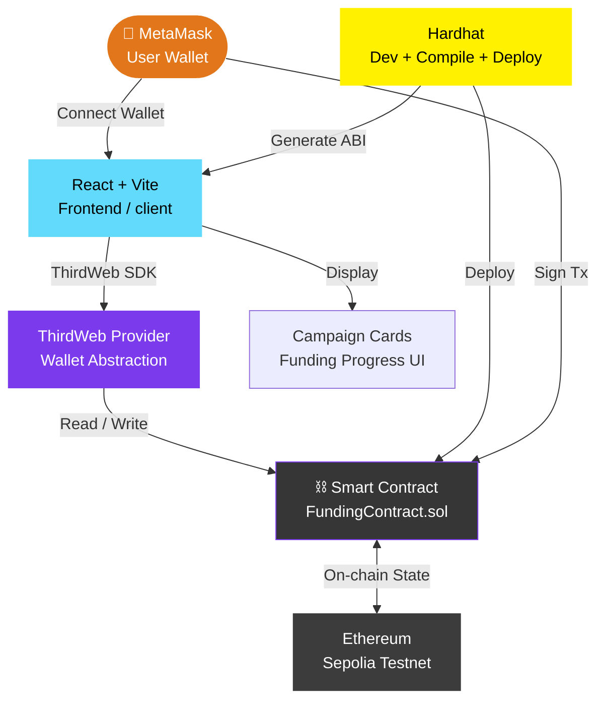

<div align="center">

```
██╗    ██╗███████╗██████╗ ██████╗     ███████╗██╗   ██╗███╗   ██╗██████╗ ██╗███╗   ██╗ ██████╗ 
██║    ██║██╔════╝██╔══██╗╚════██╗    ██╔════╝██║   ██║████╗  ██║██╔══██╗██║████╗  ██║██╔════╝ 
██║ █╗ ██║█████╗  ██████╔╝ █████╔╝    █████╗  ██║   ██║██╔██╗ ██║██║  ██║██║██╔██╗ ██║██║  ███╗
██║███╗██║██╔══╝  ██╔══██╗ ╚═══██╗    ██╔══╝  ██║   ██║██║╚██╗██║██║  ██║██║██║╚██╗██║██║   ██║
╚███╔███╔╝███████╗██████╔╝██████╔╝    ██║     ╚██████╔╝██║ ╚████║██████╔╝██║██║ ╚████║╚██████╔╝
 ╚══╝╚══╝ ╚══════╝╚═════╝ ╚═════╝     ╚═╝      ╚═════╝ ╚═╝  ╚═══╝╚═════╝ ╚═╝╚═╝  ╚═══╝ ╚═════╝ 
```

### ⛓️ A decentralized crowdfunding dApp — smart contracts on Ethereum, zero middlemen, full transparency.

<br/>

[](https://soliditylang.org/)
[](https://react.dev/)
[](https://hardhat.org/)
[](https://thirdweb.com/)

<br/>

[](https://ethereum.org/)
[](https://metamask.io/)
[](https://tailwindcss.com/)
[](https://vitejs.dev/)

<br/>

[](https://github.com/aarav12e/Web3_Funding-Site)
[](https://github.com/aarav12e/Web3_Funding-Site)
[](https://github.com/aarav12e/Web3_Funding-Site/stargazers)
[](https://github.com/aarav12e/Web3_Funding-Site/commits/main)

</div>

---

## ⛓️ What is This?

**Web3 Funding Site** is a fully decentralized crowdfunding dApp built on the **Ethereum blockchain**. Campaigns are governed by **Solidity smart contracts** — no bank, no platform fee, no middleman. Contributions go directly on-chain. Funds are only released when conditions are met. Everything is transparent, immutable, and verifiable.

> *Not your typical crowdfunding platform. The contract is the platform.*

---

## 🌐 How Web3 Crowdfunding Works

```
  TRADITIONAL CROWDFUNDING         WEB3 CROWDFUNDING
  ────────────────────────         ──────────────────────────────────────
  💸 Donor → Platform → Creator    💸 Donor → Smart Contract → Creator
  🏦 Bank holds funds              ⛓️  Blockchain holds funds
  🧾 Platform takes % cut          🚫  Zero platform fee
  🔒 Opaque — trust the company    🔍  Transparent — read the contract
  ❓ Can reverse / freeze funds    🔐  Immutable — no one can alter it
  🌍 Geography-restricted          🌐  Global — anyone with a wallet
```

---

## ✨ Features

| Feature | Description |
|---------|-------------|
| 🏗️ **Create Campaign** | Launch a crowdfunding campaign with title, description, goal & deadline |
| 💸 **Fund a Campaign** | Send ETH directly to any campaign's smart contract |
| 📋 **Browse Campaigns** | View all active campaigns with live funding progress |
| 🦊 **MetaMask Integration** | Connect your Ethereum wallet with one click |
| 🔍 **On-chain Transparency** | All transactions publicly verifiable on Etherscan |
| ⏳ **Deadline Enforcement** | Smart contract auto-enforces campaign end date |
| 🎯 **Goal Tracking** | Live progress bar showing ETH raised vs target |
| 🔐 **Trustless Execution** | No admin, no override — the contract is the law |
| 📱 **Responsive UI** | Clean Tailwind CSS interface across all screen sizes |
| 🧪 **Sepolia Testnet** | Safe sandbox deployment on Ethereum Sepolia testnet |

---

## 🏗️ Architecture — Full dApp Stack



---

## 📁 Monorepo Structure

```
Web3_Funding-Site/
│
├── 📂 web3/                          ← Solidity / Smart Contract layer
│   ├── 📂 contracts/
│   │   └── FundingContract.sol       ← Core smart contract (Solidity)
│   │
│   ├── 📂 scripts/
│   │   └── deploy.js                 ← Hardhat deploy script
│   │
│   ├── 📂 test/
│   │   └── funding.test.js           ← Contract unit tests
│   │
│   ├── hardhat.config.js             ← Hardhat network + compiler config
│   └── package.json                  ← hardhat, @nomicfoundation, ethers
│
└── 📂 client/                        ← React Frontend layer
    ├── 📂 src/
    │   ├── 📂 components/
    │   │   ├── CampaignCard.jsx       ← Individual campaign display card
    │   │   ├── CampaignForm.jsx       ← Create new campaign form
    │   │   ├── FundButton.jsx         ← Send ETH to campaign
    │   │   └── Navbar.jsx             ← Wallet connect + navigation
    │   │
    │   ├── 📂 pages/
    │   │   ├── Home.jsx               ← Browse all campaigns
    │   │   ├── CreateCampaign.jsx     ← Launch a new campaign
    │   │   └── CampaignDetail.jsx     ← Single campaign + fund button
    │   │
    │   ├── 📂 context/
    │   │   └── Web3Context.jsx        ← ThirdWeb provider + wallet state
    │   │
    │   ├── App.jsx
    │   └── main.jsx
    │
    ├── vite.config.js
    └── package.json                   ← react, thirdweb, tailwindcss, vite
```

---

## 📜 Smart Contract

The `FundingContract.sol` is the heart of this dApp — everything lives on-chain:

```solidity
// SPDX-License-Identifier: MIT
pragma solidity ^0.8.9;

contract FundingContract {

    struct Campaign {
        address owner;
        string  title;
        string  description;
        uint256 target;       // in wei
        uint256 deadline;     // unix timestamp
        uint256 amountRaised;
        string  image;
    }

    mapping(uint256 => Campaign) public campaigns;
    mapping(uint256 => address[]) public donators;
    mapping(uint256 => uint256[]) public donations;

    uint256 public numberOfCampaigns = 0;

    // Create a new campaign — stored permanently on-chain
    function createCampaign(
        address _owner,
        string memory _title,
        string memory _description,
        uint256 _target,
        uint256 _deadline,
        string memory _image
    ) public returns (uint256) {
        require(_deadline > block.timestamp, "Deadline must be in the future");
        campaigns[numberOfCampaigns] = Campaign(
            _owner, _title, _description, _target, _deadline, 0, _image
        );
        return numberOfCampaigns++;
    }

    // Fund a campaign — ETH sent directly to contract
    function donateToCampaign(uint256 _id) public payable {
        Campaign storage campaign = campaigns[_id];
        require(block.timestamp < campaign.deadline, "Campaign has ended");

        campaign.amountRaised += msg.value;
        donators[_id].push(msg.sender);
        donations[_id].push(msg.value);
    }

    // Retrieve all campaigns
    function getCampaigns() public view returns (Campaign[] memory) {
        Campaign[] memory allCampaigns = new Campaign[](numberOfCampaigns);
        for (uint i = 0; i < numberOfCampaigns; i++) {
            allCampaigns[i] = campaigns[i];
        }
        return allCampaigns;
    }
}
```

---

## 🦊 MetaMask & ThirdWeb Integration

```javascript
// client/src/context/Web3Context.jsx
import { ThirdwebProvider, useAddress, useContract, useContractWrite } from "@thirdweb-dev/react";

// Wrap app with ThirdWeb provider on Sepolia
<ThirdwebProvider activeChain="sepolia">
    <App />
</ThirdwebProvider>

// Connect wallet — one line with ThirdWeb
const address = useAddress();            // "0xAbC...123" or undefined

// Call smart contract function
const { contract } = useContract(CONTRACT_ADDRESS);
const { mutateAsync: createCampaign } = useContractWrite(contract, "createCampaign");

const handleCreate = async () => {
    await createCampaign({
        args: [
            address,
            "Build a Hospital in Jaipur",
            "We need ₹10 lakh to fund...",
            ethers.utils.parseEther("0.5"),  // 0.5 ETH target
            new Date("2025-12-31").getTime() / 1000,
            "https://image.url"
        ]
    });
};
```

---

## 🔄 dApp Flow

```
  🦊 User opens the site
           │
           ▼
  [ Connect Wallet ] — MetaMask popup
           │
           ▼
  ✅ Wallet connected → address shown in navbar
           │
           ├──────────────────────────────────┐
           ▼                                  ▼
  📋 Browse Campaigns               🏗️ Create Campaign
  ────────────────────               ──────────────────────
  All campaigns fetched              Fill in: title, desc,
  from on-chain state                target ETH, deadline,
  via getCampaigns()                 image URL
           │                                  │
           ▼                                  ▼
  Click a Campaign Card              Sign tx in MetaMask
           │                                  │
           ▼                                  ▼
  📄 Campaign Detail Page            ⛓️ Campaign stored
  Shows: raised / target             permanently on-chain
  progress bar, donators
           │
           ▼
  💸 Enter ETH amount → [ Fund This Campaign ]
           │
           ▼
  MetaMask popup: confirm transaction + gas fee
           │
           ▼
  ⛓️ ETH sent → donateToCampaign() executes
           │
           ▼
  📊 Progress bar updates — live from blockchain
```

---

## 🛠️ Tech Stack

### 📂 `web3/` — Smart Contract Layer

| Technology | Purpose |
|-----------|---------|
|  | Smart contract language |
|  | Compile, test, deploy contracts locally |
|  | Interact with Ethereum in deploy scripts |
|  | Ethereum test network for safe deployment |

### 📂 `client/` — Frontend Layer

| Technology | Purpose |
|-----------|---------|
|  | UI component framework |
|  | Fast build tool & dev server |
|  | Wallet connect + contract interaction |
|  | Browser wallet for signing transactions |
|  | Utility-first CSS styling |

---

## ⚙️ Environment Variables

### `web3/.env`

```env
# ─── Wallet ─────────────────────────────────────────────────
PRIVATE_KEY=your_wallet_private_key_here   # ⚠️ Never commit this!

# ─── Network ─────────────────────────────────────────────────
SEPOLIA_RPC_URL=https://sepolia.infura.io/v3/YOUR_INFURA_KEY
```

### `client/.env`

```env
# ─── Smart Contract ──────────────────────────────────────────
VITE_CONTRACT_ADDRESS=0xYourDeployedContractAddress

# ─── ThirdWeb ────────────────────────────────────────────────
VITE_THIRDWEB_CLIENT_ID=your_thirdweb_client_id
```

> 🔐 **NEVER commit your `PRIVATE_KEY` to GitHub.** Anyone with it controls your wallet.

---

## 🚀 Getting Started

### Prerequisites

```bash
node --version      # v18+ required
npm --version       # v9+
# MetaMask browser extension installed
# Sepolia testnet ETH (free from faucet.sepolia.dev)
```

### Step 1 — Deploy the Smart Contract

```bash
cd web3
npm install

# Compile the Solidity contract
npx hardhat compile

# Run contract tests
npx hardhat test

# Deploy to Sepolia testnet
npx hardhat run scripts/deploy.js --network sepolia

# ✅ Copy the deployed contract address — you'll need it for the frontend
```

### Step 2 — Run the Frontend

```bash
cd ../client
npm install

# Set your contract address
echo "VITE_CONTRACT_ADDRESS=0xYourAddress" > .env

# Start the dev server
npm run dev         # Opens at http://localhost:5173
```

### Step 3 — Connect MetaMask

```
1. Install MetaMask browser extension
2. Switch network to "Sepolia Testnet"
3. Get free test ETH → https://faucet.sepolia.dev
4. Click "Connect Wallet" on the site
5. Start creating and funding campaigns!
```

---

## 📡 Hardhat Commands

```bash
# Compile contracts
npx hardhat compile

# Run tests
npx hardhat test

# Start local Hardhat node (local blockchain)
npx hardhat node

# Deploy to local network
npx hardhat run scripts/deploy.js --network localhost

# Deploy to Sepolia testnet
npx hardhat run scripts/deploy.js --network sepolia
```

---

## ⛓️ On-Chain Transparency

Every action on this platform is publicly verifiable:

```
  Create Campaign  →  TX hash: 0x4a7f...d91e  →  View on Etherscan ↗
  Fund Campaign    →  TX hash: 0x9b2c...f451  →  View on Etherscan ↗
  Contract Code    →  0xYourContract          →  Verified source code ↗

  Anyone can read the contract. No hidden logic. No admin backdoors.
  The blockchain is the source of truth.
```

---

## 🗺️ Roadmap

```
  ✅ Done
  ──────────────────────────────────────────────────
  ✅ Smart contract: create + fund campaigns
  ✅ MetaMask wallet connection (ThirdWeb)
  ✅ Campaign browsing UI
  ✅ Sepolia testnet deployment

  🔜 Future Ideas
  ──────────────────────────────────────────────────
  🔜 Refund mechanism if goal not met by deadline
  🔜 Campaign owner withdraw function
  🔜 IPFS image hosting for campaign thumbnails
  🔜 ENS name display instead of raw 0x addresses
  🔜 Multi-chain support (Polygon, Base, Arbitrum)
  🔜 Campaign category tags + search filter
  🔜 Email/push notifications via Push Protocol
```

---

## 🤝 Contributing

```bash
git checkout -b feature/refund-mechanism
git commit -m "feat: add refund if campaign goal not met"
git push origin feature/refund-mechanism
```

---

## 👨‍💻 Author

<div align="center">

**Aarav Kumar**
*Web3 Developer · Solidity · React · B.Tech CDS (2028) · Ignite Club*

[](https://github.com/aarav12e)

</div>

---

<div align="center">

```
  ┌────────────────────────────────────────────────────────────┐
  │                                                            │
  │   Contract Address : 0xDeploy...YourContract              │
  │   Network          : Ethereum Sepolia Testnet             │
  │   Compiler         : Solidity ^0.8.9                      │
  │   Status           : ✅ Verified & Deployed               │
  │                                                            │
  │   "Code is law. The contract never lies."                 │
  │                                                            │
  └────────────────────────────────────────────────────────────┘
```

*Built with ⛓️ Solidity + React — because fundraising should be trustless*

**`< / Web3_Funding-Site >`**

</div>
